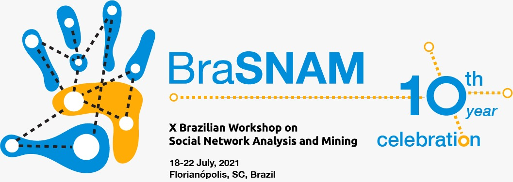

# BrasNAM (Brazilian Workshop on Social NetworkAnalysis and Mining) 10 years

> Since 2012, the Brazilian Workshop on Social Network Analysis and Mining (BraSNAM) represents an important forum to bring together researchers in order to discuss analysis methods, trends and phenomena that occur in social networks. In 2021, this event completes 10 years, with 230 works presented so far.

This dataset presents data from these works, which were extracted from the following sources: 

* the <a href="https://sol.sbc.org.br/index.php/brasnam/issue/archive">SOL database</a>, from <a href="https://www.sbc.org.br">SBC</a>; 
* <a href="https://scholar.google.com.br/">Google Scholar</a>;
* the <a href="https://servicodados.ibge.gov.br/api/docs/nomes?versao=2">API Names</a> of the data service of the Brazilian Institute of Geography and Statistics (IBGE);
* data from social networks such as Facebook and Twitter.

## 🤝 Team

<table>
  <tr>
    <td align="center">
      <a href="https://orcid.org/0000-0002-6282-0368">
         
        
          <b>Fábio M. F. Lobato</b>
        
      </a>
    </td>
    <td align="center">
      <a href="https://orcid.org/0000-0001-7873-0423">
         
        
          <b>Gleyce C. de Sousa</b>
        
      </a>
    </td>
    <td align="center">
      <a href="https://orcid.org/0000-0002-9415-7265">
         
        
          <b>Antonio F. L. Jacob Junior</b>
        
      </a>
    </td>
  </tr>
</table>

## 📝 To cite this work, please use

> Paper
Fábio M. F. Lobato, Gleyce C. de Sousa, & Antonio F. L. Jacob Junior. (2021). BraSNAM em perspectiva: uma análise da sua trajetória até os 10 anos de existência. In: BrasNAM (Brazilian Workshop on Social NetworkAnalysis and Mining).

> Dataset
Fábio M. F. Lobato, Gleyce C. de Sousa, & Antonio F. L. Jacob Junior. (2021). BrasNAM (Brazilian Workshop on Social NetworkAnalysis and Mining) 10 years [Data set]. Zenodo. http://doi.org/10.5281/zenodo.5038638

[⬆ Voltar ao topo](#nome-do-projeto) 
